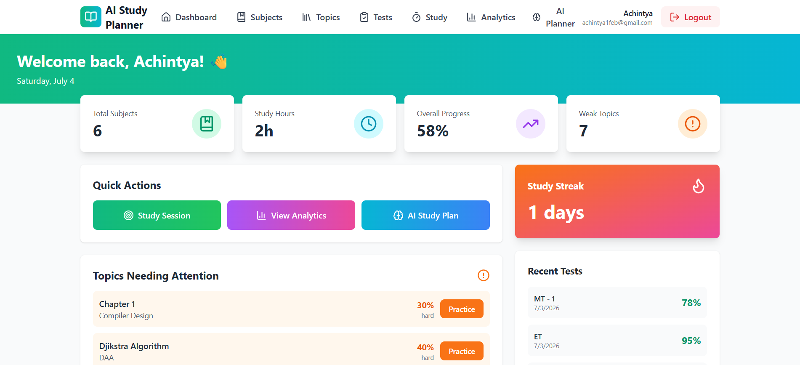
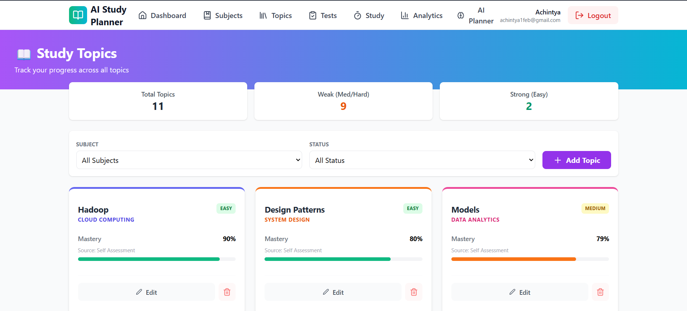
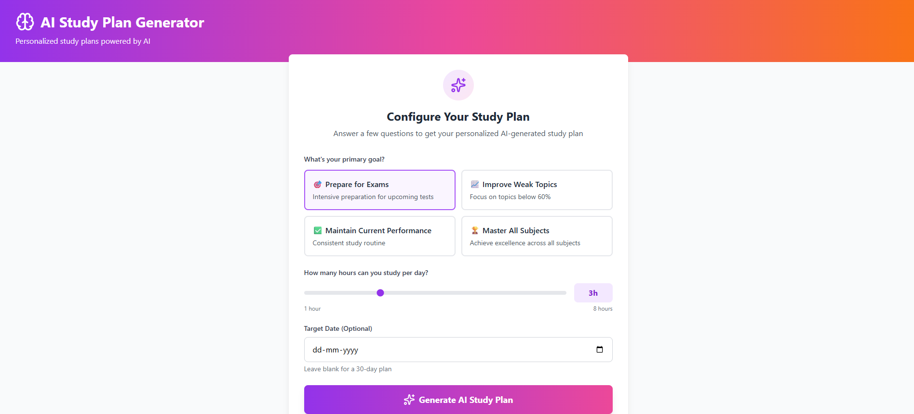
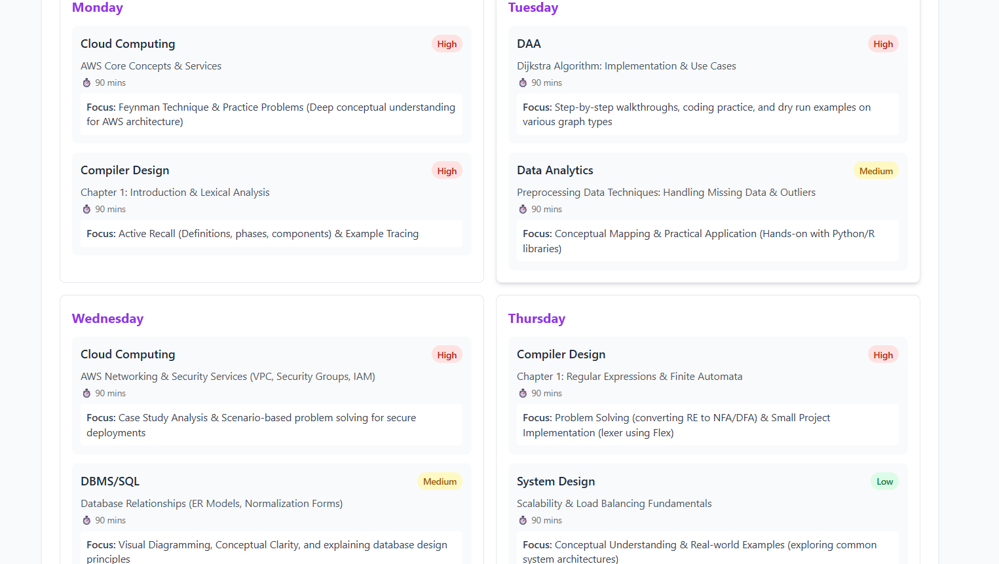
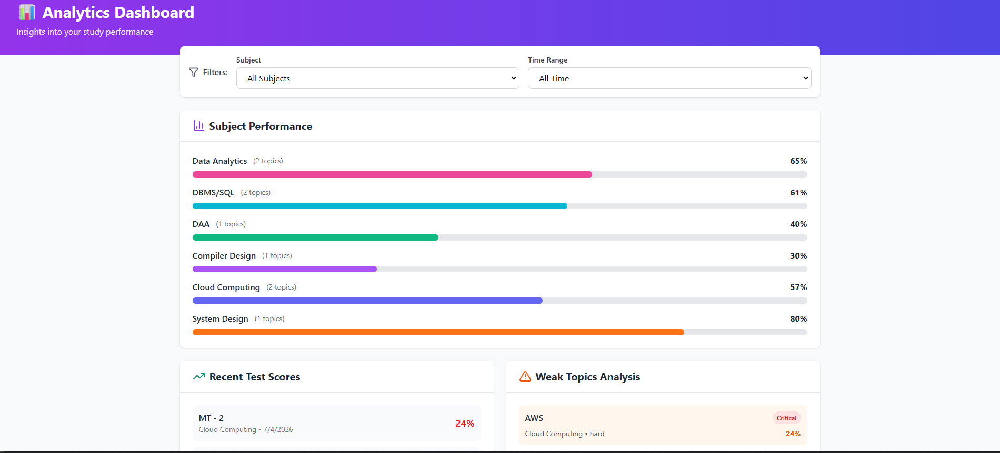

# AI Study Planner

> An AI-powered full-stack web application that helps students track academic progress, analyze strengths and weaknesses, and generate personalized study plans using Google Gemini.

<p align="center">


</p>

<p align="center">

Frontend • React + Tailwind CSS

Backend • Node.js + Express

Database • MongoDB Atlas

Authentication • JWT

AI • Google Gemini

</p>

---

## Overview

AI Study Planner is a full-stack web application designed to help students monitor academic performance and make data-driven study decisions.

Instead of acting as a simple task manager, the application continuously tracks academic progress through subjects, topics, tests, and study sessions. Performance data is synchronized automatically and used to generate personalized recommendations through Google Gemini.

The application combines progress tracking, analytics, AI-assisted planning, and performance visualization into a single platform.

---

## Why This Project?
```
Academic progress is often scattered across multiple platforms—class notes, spreadsheets, calendars, and AI chatbots.

AI Study Planner consolidates these workflows into a single application where students can track performance, monitor subject mastery, log study sessions, and generate personalized study plans using Google Gemini.
```

The application analyzes historical data to determine:

- Which subjects need attention
- Which topics are improving
- Which concepts are becoming weaker
- How available study time should be allocated

The goal is to create a study planner driven by academic performance instead of checklists.


# Features

| Module | Description |
|----------|-------------|
| Dashboard | Displays overall academic performance, statistics and recent activity. |
| Subjects | Organize academic subjects and monitor overall mastery. |
| Topics | Track concept-level understanding inside each subject. |
| Tests | Record topic tests or complete subject examinations. |
| Study Sessions | Log study sessions and monitor productivity. |
| Analytics | Visualize performance trends across subjects. |
| AI Subject Analysis | Generate personalized feedback using Google Gemini. |
| AI Study Planner | Produce adaptive downloadable weekly study plans based on current performance. |

---

# Screenshots

## Dashboard




Displays:

- Overall progress
- Subject mastery
- Recent activity
- Performance statistics
- Study Streak

## Subjects


Each subject contains:

- Current mastery
- Number of topics
- AI analysis
- Subject statistics

## Topics




Topics represent individual concepts inside each subject.

Every topic begins with an initial assessment and later updates automatically based on real test performance.

## Tests


Supports two assessment types:

- Topic-specific tests
- Whole-subject examinations

The application automatically recalculates progress after every recorded assessment.

## AI Planner





Generates personalized study plans using:

- Weak topics
- Subject performance
- Available study hours
- User goals


## Analytics



Visualizes long-term academic progress using interactive charts and summary statistics.

# Technology Stack


| Category       | Technology    |
|----------------|---------------|
| Frontend       | React 19      |
| Styling        | Tailwind CSS  |
| Backend        | Node.js       |
| Framework      | Express.js    |
| Database       | MongoDB Atlas |
| Authentication | JWT           |
| AI             | Google Gemini |
| HTTP Client    | Axios         |
| ODM            | Mongoose      |

---

# System Architecture

```
                     ┌────────────────────────────┐
                     │        React Frontend      │
                     │----------------------------│
                     │ Dashboard                  │
                     │ Subjects                   │
                     │ Topics                     │
                     │ Tests                      │
                     │ Study Sessions             │
                     │ AI Planner                 │
                     └─────────────┬──────────────┘
                                   │
                             REST API (Axios)
                                   │
                     ┌─────────────▼──────────────┐
                     │      Express Backend       │
                     │----------------------------│
                     │ Authentication             │
                     │ Business Logic             │
                     │ AI Services                │
                     │ Progress Synchronization   │
                     └───────┬──────────┬─────────┘
                             │          │
                      Gemini API    MongoDB Atlas

```
The frontend is responsible for rendering the user interface and interacting with the REST API.

Business logic—including authentication, mastery calculation, AI prompt generation, and synchronization—is handled entirely by the backend.

Persistent data is stored in MongoDB while Google Gemini generates intelligent study recommendations.

---

# Project Structure


```
AI-Study-Planner

├── backend
│
├── config
├── middleware
├── models
│ ├── User.js
│ ├── Subject.js
│ ├── Topic.js
│ ├── Test.js
│ └── StudySession.js
│
├── routes
│ ├── auth.js
│ ├── subjects.js
│ ├── topics.js
│ ├── tests.js
│ ├── sessions.js
│ └── ai.js
│
├── utils
│ ├── updateTopicScore.js
│ └── updateSubjectProgress.js
│
└── server.js

frontend

├── pages
├── components
├── services
└── App.jsx
```


# Backend Design

The backend follows a modular REST architecture.

Each route is responsible for a single domain:

- Authentication
- Subjects
- Topics
- Tests
- Study Sessions
- AI

Business logic shared across multiple routes is extracted into reusable utility functions.

Examples include:

- `updateTopicScore()`
- `updateSubjectProgress()`

This prevents duplicated logic and ensures consistent synchronization across the application.

---

# Authentication

Authentication is implemented using JSON Web Tokens (JWT).

Workflow:

1. User logs in.
2. Server generates a signed JWT.
3. Frontend stores the token.
4. Every protected request includes the JWT.
5. Authentication middleware verifies the token.
6. Users only access their own academic data.

---

# Database Design

```
User
│
├── Subjects
│ │
│ ├── Topics
│ │ │
│ │ └── Tests
│ │
│ └── Subject Tests
│
└── Study Sessions
```

Every user owns an independent academic workspace.

Subjects organize academic areas.

Topics represent individual concepts.

Tests may belong either to a topic or directly to a subject.

Study sessions remain independent for productivity tracking.

---

# Supporting Whole-Subject Assessments

Real academic examinations often evaluate an entire subject instead of individual topics.

To support this, tests may optionally omit the topic reference.

When a subject-wide examination is recorded:

- Topic mastery remains unchanged.
- Subject mastery is updated.
- Historical performance is preserved.

This prevents users from artificially distributing marks across unrelated topics.

# AI Integration

Google Gemini powers the intelligent features of the application by generating personalized academic recommendations instead of generic study advice.

Rather than sending a simple prompt, the backend constructs contextual prompts using the student's own academic data collected from the database.

This enables the AI to provide responses tailored to each student's strengths, weaknesses, recent performance, and study habits.

Current AI capabilities include:

- Personalized subject analysis
- Weekly study plan generation
- Improvement suggestions
- Study prioritization
- Performance insights

---

## AI Workflow

```text
Student Requests AI Analysis
            │
            ▼
Frontend sends API request
            │
            ▼
Backend collects user data
            │
            ├── Subjects
            ├── Topics
            ├── Tests
            ├── Study Sessions
            │
            ▼
Constructs Prompt
            │
            ▼
Google Gemini API
            │
            ▼
AI Response Generated
            │
            ▼
Displayed in React
```

The backend acts as an orchestration layer, ensuring that Gemini receives structured, relevant academic context rather than isolated prompts.

---

# Mastery Calculation

Unlike traditional study trackers where progress is manually edited, mastery in AI Study Planner evolves automatically as new assessments are recorded.

This allows progress to reflect actual academic performance rather than subjective estimates.

---

## Initial Assessment

When creating a new topic, the user provides an **Initial Assessment** representing their estimated understanding of that topic.

Examples:


| Topic               | Initial Assessment |
|---------------------|--------------------|
| Arrays              |         40%        |
| Binary Trees        |         65%        |
| Dynamic Programming |         20%        | 

---

This value is only used as the starting point.

Once enough real assessments are recorded, actual test performance replaces the initial estimate.

---

## Topic Mastery Algorithm

Topic mastery is calculated using the **latest three tests** recorded for that topic.

Using recent assessments ensures that improvement is reflected quickly while preventing very old scores from dominating progress.

Example:

```text
Initial Assessment - 40%

    ↓

Test 1 - 55%

    ↓

Test 2 - 70%

    ↓

Test 3 - 82%

    ↓

Mastery = (55 + 70 + 82) / 3 = 69%
```

Advantages of using the latest three tests:

- Reflects current understanding
- Rewards improvement
- Prevents outdated scores from affecting mastery indefinitely
- Automatically updates after every new assessment

---

## Subject Mastery

Subject mastery represents overall understanding of an entire subject.

The application supports **two different types of assessments**:

1. Topic-level tests
2. Whole-subject tests

When only topic tests exist:

```text
Subject Mastery = Average of Topic Mastery
```

When whole-subject tests also exist, they contribute to the overall subject score without modifying individual topics.

```text
Subject Mastery = (0.7 × Average Topic Mastery) + (0.3 × Average Subject Test Average)
```

This design mirrors real academic environments where students receive both chapter tests and comprehensive examinations.

---

# Progress Synchronization

Whenever academic data changes, related statistics are synchronized automatically.

This prevents inconsistencies between pages and removes the need for manual updates.

Workflow:

```text
New Test Recorded
        │
        ▼
updateTopicScore()
        │
        ▼
Topic Mastery Updated
        │
        ▼
updateSubjectProgress()
        │
        ▼
Subject Mastery Updated
        │
        ▼
Dashboard Automatically Reflects Changes
```

Synchronization logic is extracted into reusable utility functions rather than duplicated across route handlers.

Current utility functions include:

- `updateTopicScore()`
- `updateSubjectProgress()`

This keeps the backend modular, maintainable, and consistent.

---

# Installation

## Clone the Repository

```bash
git clone https://github.com/YOUR_USERNAME/ai-study-planner.git
```

---

## Backend

```bash
cd backend

npm install

npm run dev
```

---

## Frontend

```bash
cd frontend

npm install

npm run dev
```

---

# Environment Variables

Create a `.env` file inside the **backend** directory.

```env
PORT=

MONGO_URI=

JWT_SECRET=

GEMINI_API_KEY=
```
---

# Deployment

The project is designed for cloud deployment.


| Service  | Platform      |
|----------|---------------|
| Frontend | Vercel        |
| Backend  | Render        |
| Database | MongoDB Atlas |
| AI       | Google Gemini |

---

# REST API Overview


| Method | Endpoint                 | Description                  |
|--------|--------------------------|------------------------------|
| POST   | /api/auth/register       | Register user                | 
| POST   | /api/auth/login          | Login                        |
| GET    | /api/subjects            | Fetch subjects               |
| POST   | /api/subjects            | Create subject               |
| GET    | /api/topics              | Fetch topics                 |
| POST   | /api/topics              | Create topic                 |
| GET    | /api/tests               | Fetch tests                  |
| POST   | /api/tests               | Record test                  |
| GET    | /api/sessions            | Fetch study sessions         |
| POST   | /api/sessions            | Log study session            |
| POST   | /api/ai/subject-analysis | Generate AI subject analysis |
| POST   | /api/ai/study-plan       | Generate AI weekly plan      |

---

# Lessons Learned

Building this project provided practical experience with:

- Full-stack MERN application development
- REST API design
- JWT authentication
- MongoDB data modeling
- React state management
- Tailwind CSS
- Backend architecture
- Google Gemini integration
- AI prompt engineering
- CRUD application design
- Business logic abstraction
- Progress synchronization
- Cloud deployment

One of the most valuable lessons was separating business logic from route handlers by introducing reusable utility functions. This improved maintainability and made synchronization logic easier to extend as the application evolved.

---

# Contributing

Contributions, suggestions, and feedback are welcome.

If you discover a bug or have ideas for improving the project, feel free to open an issue or submit a pull request.

---

# License

This project is licensed under the MIT License.

---

# Author

**Achintya Srivastava**

Computer Science Student

- GitHub: https://github.com/Achintya1205
- LinkedIn: https://www.linkedin.com/in/achintya-srivastava-163231325/

If you found this project useful, consider giving it a ⭐ on GitHub.